# Warm-Up

## One Question for Today

You collect 25 personality survey items.

How many *real* traits are they actually measuring?

::: {.notes}
Ask the room this directly before advancing. Let a few students answer out loud.
:::

## You've Done This Before

You've taken an MBTI quiz. Dozens of questions.

One result: *INFP, ESTJ, whatever it was.*

That collapsing of many answers into a few types — that's data reduction.

## But Here's the Catch

MBTI's four letters were **designed**, not discovered.

A theory came first; the categories were built to fit it.

## The Big Five Was Built the Other Way Around

Psychologists collected thousands of personality descriptions.

Ran the numbers. Five traits kept surfacing — every time, every sample.

**That's today's method. And it's today's dataset.**

## Same Idea, Now With Real Items

25 personality items, grouped by how people actually answered them.

Five traits emerge: Openness, Conscientiousness, Extraversion, Agreeableness, Neuroticism.

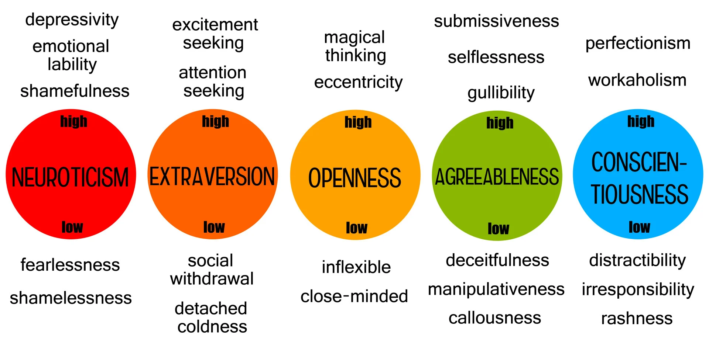{fig-align="center"}

<!-- 🖼️ PNG PLACEHOLDER: personality items grouped by color into the 5 Big Five traits (O/C/E/A/N) -->

## Today's Two Techniques

**PCA** — summarises your data as-is.

**EFA** — assumes hidden traits *cause* the pattern in your data.

We'll spend a little time on PCA, and most of our time on EFA.

## By the End of Today

You'll be able to answer three questions:

1. PCA or EFA — which one do I need?
2. How many factors should I keep?
3. How do I read a factor loading table?

---

# Part 1: Principal Component Analysis

## The Idea Behind PCA

Many survey items are correlated with each other.

PCA squeezes them into a few components.

Each component captures as much information as possible.

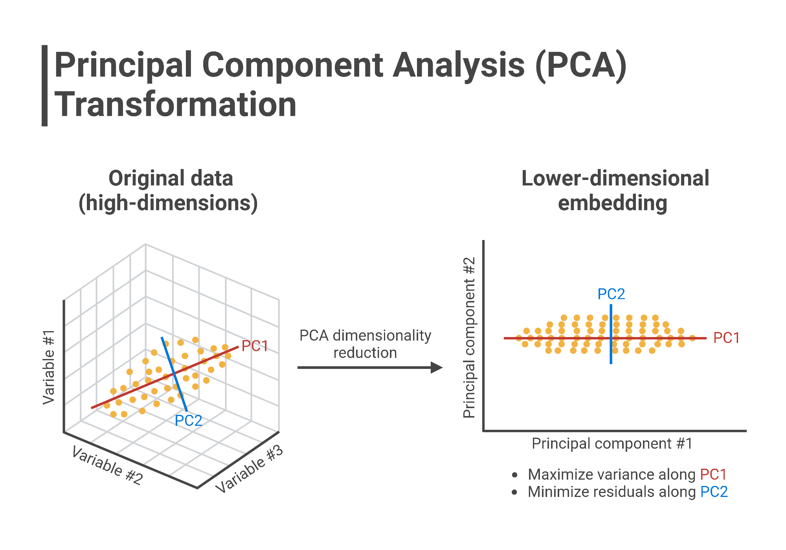{fig-align="center"}

## One Picture

Two correlated variables, plotted together.

One line best summarises both of them.

That line is the first principal component.

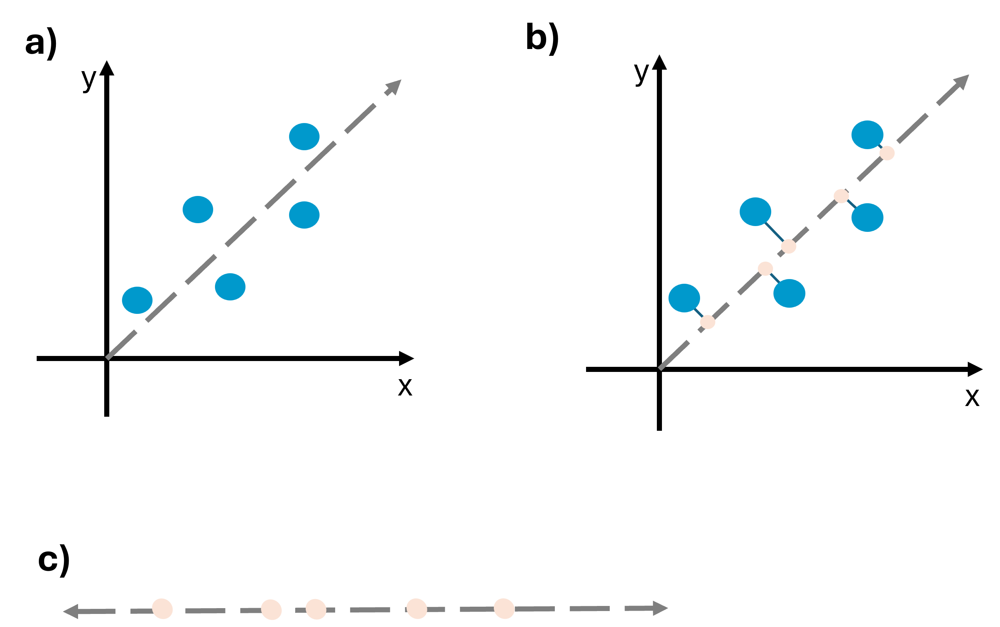{fig-align="center"}

<!-- 🖼️ PNG PLACEHOLDER: scatterplot of two correlated variables with the first principal component drawn as a best-fit line -->

## What Is an Eigenvalue?

Not a scary formula — just a score.

It tells you how much information one component captures.

Compare it to what a single original item would capture on its own.

## Where That Score Actually Comes From {.smaller}

PCA sits in the same family as MANOVA and discriminant function analysis (DFA) — all three work from a correlation, or variance-covariance, matrix.

The question PCA asks: could you separate the data using some linear combination of the variables?

Answering that means calculating the **eigenvectors** of that matrix — each eigenvector's eigenvalue is exactly the "score" from the last slide.

**Rule of thumb:** retain the components with the largest eigenvalues; ignore the small ones.

## Deciding How Many Components: The Scree Plot

Plot each component's eigenvalue, largest to smallest.

The line drops fast, then flattens out.

Keep the components *before* it flattens.

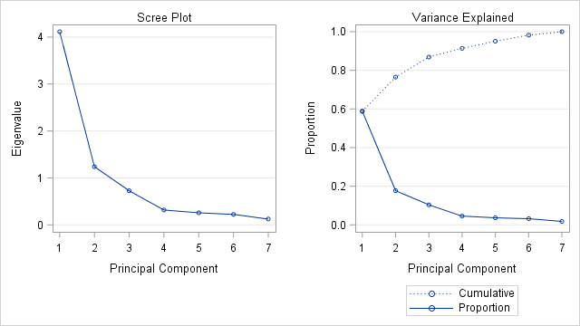{fig-align="center"}

<!-- 🖼️ PNG PLACEHOLDER: scree plot with the "elbow" labelled, generated from bfi or HolzingerSwineford1939 -->

## Where PCA Shows Up in Psychology

Shrinking many biometric or behavioural measures into a few scores.

Useful when you just want a compact *summary* of your data.

## PCA Is Used Everywhere, Not Just Psychology

Same technique, completely different fields.

Cancer subtype classification from gene expression data. Rating hundreds of cities on liveability.

::: columns
::: {.column width="50%"}
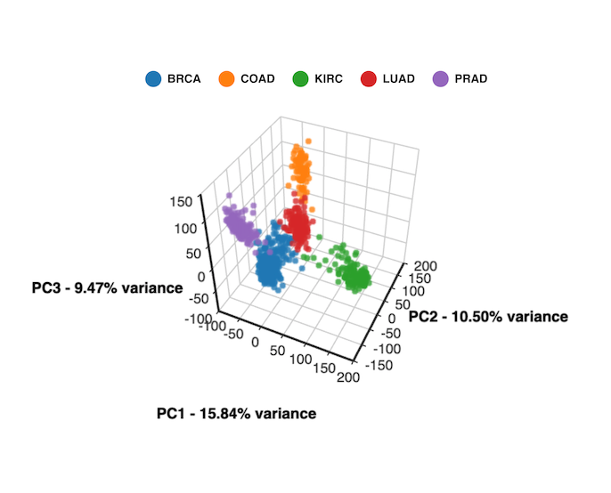{fig-align="center"}
:::
::: {.column width="50%"}
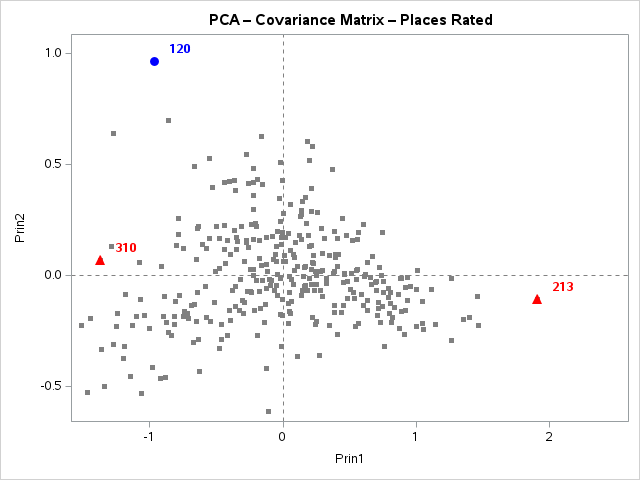{fig-align="center"}
:::
:::

## The Catch With PCA

PCA describes your data — nothing more.

It doesn't assume anything *caused* the pattern.

But in psychology, we usually believe something *did* cause it.

## The Pivot

You believe a real trait — like anxiety — makes people answer the way they do.

That trait is never measured directly.

You need a technique built around that assumption.

**That technique is EFA.**

---

# Part 2: Exploratory Factor Analysis

## What Is Factor Analysis?

A technique that identifies groups, or clusters, of variables that go together.

It reduces many variables down to a few — but with a specific reason behind the reduction.

You use it when you can't measure the construct (the latent variable) directly, only different aspects of it.

FA checks whether those different aspects are being driven by the same underlying variable.

## The Core Idea of EFA

Items are correlated *because* a hidden trait influences all of them.

Each item also has its own leftover error.

That's the whole logic of EFA.

## The Picture to Remember

One hidden factor. Several observed items. One error per item.

Keep this image in mind for the rest of today.

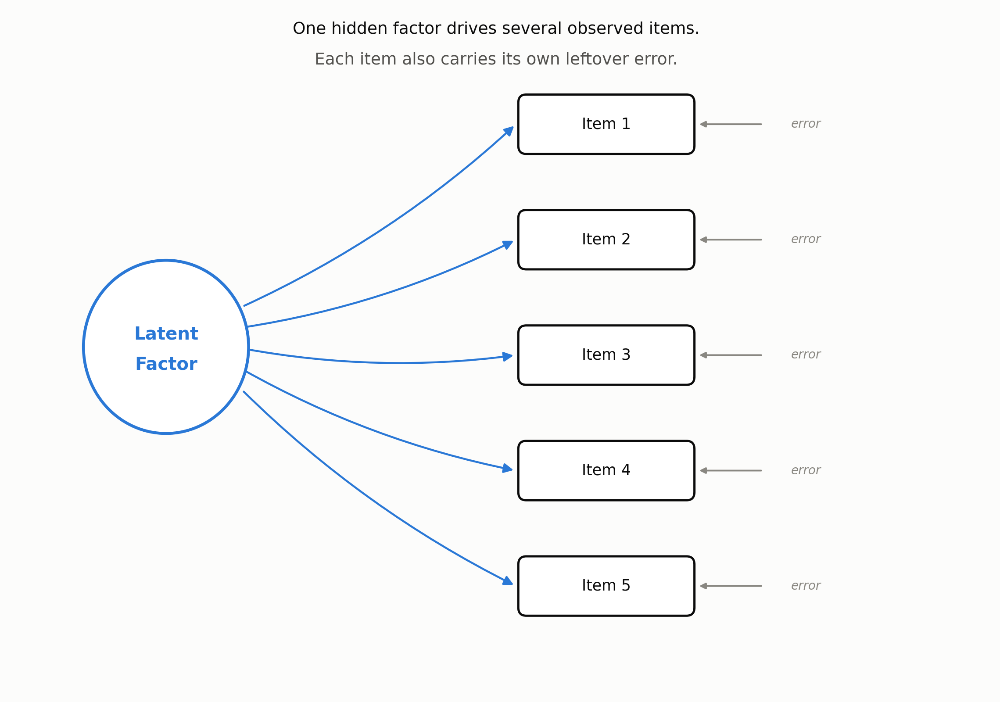{fig-align="center"}

<!-- 🖼️ PNG PLACEHOLDER: path diagram — one latent factor (circle) with arrows to several observed items (boxes), plus a short error arrow into each item -->

## Where the Correlations Live: the R-Matrix

Every EFA starts from the same object: a table of correlations between all your items.

Statisticians call it the R-matrix.

EFA and PCA both try to reduce this matrix into a much smaller set of uncorrelated dimensions.

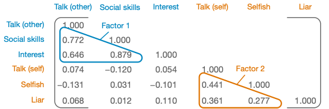{fig-align="center"}

## Reading a Factor Loading {.smaller}

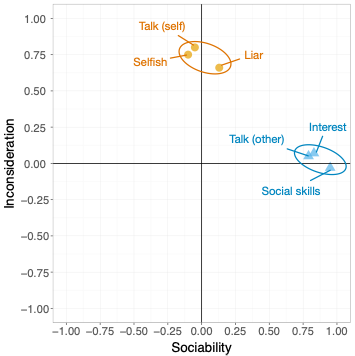{style="float:right; width:42%; margin:0 0 0.5em 1.5em;"}

A loading is nothing exotic — it's a Pearson correlation between an item and a factor.

Plot two factors as axes; each item lands somewhere based on how strongly it correlates with each one.

Items that cluster together on the plot share a factor.

## The Maths, Briefly {.smaller}

You will never calculate this by hand — Jamovi does it — but the logic is worth seeing once.

**Item score = item mean + (loading × common factor) + unique factor**

$$x = \mu + \Lambda\xi + \delta$$

*x* = the observed item, *μ* = its mean, *Λ* = the factor loading, *ξ* = the common factor, *δ* = the unique factor.

The "common factor" is the hidden trait; the "unique factor" is everything about that item the hidden trait doesn't explain, including measurement error.

## The Maths, Continued: PCA's Version {.smaller}

PCA writes it differently — no hidden trait, no error term. A component is just a weighted sum of the items themselves.

$$Y_i = b_1X_{1i} + b_2X_{2i} + \cdots + b_nX_{ni}$$

$$\text{Component}_i = b_1(\text{Variable}_{1i}) + b_2(\text{Variable}_{2i}) + \cdots + b_n(\text{Variable}_{ni})$$

Here *b* is still called a "loading" — but now it's just a regression-style weight, not a correlation with a hidden trait.

*Worked example (SAQ data): Sociability~i~ = b~1~Talk(other)~i~ + b~2~SocialSkills~i~ + b~3~Interest~i~ + b~4~Talk(self)~i~ + b~5~Selfish~i~ + b~6~Liar~i~*

## Loadings, Collected: The Factor Matrix {.smaller}

Both FA and PCA are linear models where loadings act as weights.

Collect every item's loadings into one matrix — called the **factor matrix** (FA) or **component matrix** (PCA).

FA's key assumption, which PCA does *not* share: these algebraic factors represent real, underlying dimensions — not just convenient arithmetic.

$$\Lambda = \begin{pmatrix} 0.87 & 0.01 \\ 0.96 & -0.03 \\ 0.92 & 0.04 \\ 0.00 & 0.82 \\ -0.10 & 0.75 \\ 0.09 & 0.70 \end{pmatrix}$$

## Factor Scores: Putting a Number on the Hidden Trait

A factor score describes *each person* on a factor — combining the variables measured with how strongly each one matters (its loading).

The usual approach is the **regression method**: loadings are adjusted to account for the original correlations between variables. (Other methods exist: Bartlett, Anderson-Rubin.)

Two common uses: reducing a large data set to a smaller set of scores, and combining collinear predictors into a single factor to fix multicollinearity in a regression.

## Why This Matters for You

Almost every psychological questionnaire is built this way.

Personality, mood, attitudes, wellbeing — all validated using this logic.

If you build a scale for your thesis, you will use EFA.

## When and Why You'd Reach for EFA {.smaller}

Four situations come up again and again in psychology research.

**To test for clusters, or understand the structure, of a set of variables** — e.g. *what is the structure of intelligence?*

**To construct a questionnaire that measures an underlying variable** — e.g. *how do you design a questionnaire to measure "love"?*

**To reduce a data set to a manageable size**, while keeping as much of the original information as possible.

## When and Why, Continued: A Common Dimension

Sometimes several measures look different on the surface but may be tapping the same underlying dimension.

*Example:* anal-retentiveness, number of friends, and social skills might all be aspects of one common dimension — "statistical ability."

EFA is how you'd test whether that's actually true, rather than just assuming it.

## The EFA Workflow — Six Decisions

Today we walk through six decisions a researcher makes.

Each one builds on the last.

## Decision 1: Is My Data Suitable?

Are my items correlated *enough* to bother factor-analysing?

Two checks, both reported automatically in Jamovi.

## Decision 1, Continued: The Two Checks {.smaller}

| Check | Question It Answers |
|---|---|
| KMO (Kaiser-Meyer-Olkin) | Is there enough shared correlation among items overall? |
| Bartlett's test | Is the correlation matrix different from "no correlation at all"? |

## Decision 2: How Many Factors?

Same question as PCA — but now, more tools to answer it.

Three common methods. They don't always agree.

## Decision 2, Continued: Comparing the Three Methods {.smaller}

| Method | Rule | How Reliable |
|---|---|---|
| Kaiser (eigenvalue > 1) | Keep any factor with eigenvalue above 1 | Easiest, but tends to over-extract |
| Scree plot | Keep factors before the line flattens | Quick visual check, some judgement needed |
| Parallel analysis | Keep factors stronger than random noise | Most trustworthy — use this as your default |

<!-- If Kaiser/scree/parallel analysis disagree, trust parallel analysis and explain why in your write-up -->

## When the Methods Disagree

Kaiser tends to suggest too many factors.

Parallel analysis compares against random data — a fairer test.

**Default to parallel analysis.**

## Decision 3: How Do We Extract the Factors?

A method estimates the hidden trait from what items share in common.

You don't need the maths — Jamovi does this for you.

## Extraction Is One of Several Ways to "Discover" Factors {.smaller}

Today's extraction step sits inside a bigger family of methods for finding structure in data.

**Exploratory** — you don't know the structure yet, so you let the data suggest it: PCA, Principal Factor Analysis (PFA), Independent Component Analysis (ICA). *This is EFA's family, and where today's Decision 3 choices live.*

**Confirmatory** — you already have a hypothesis about the structure and are testing whether the data fits it: Structural Equation Modelling, Confirmatory Factor Analysis (CFA). *That's next week's topic.*

## Decision 3, Continued: Two Common Choices {.smaller}

| Method | In Plain Terms |
|---|---|
| Principal axis factoring | Uses only the variance items share with each other |
| Maximum likelihood | Also lets you test how well the model fits — useful if you want fit statistics |

## What Extraction Is Actually Estimating: Communality

Communality = the proportion of an item's variance that's shared with the other items.

1.0 → all shared. 0 → nothing shared. Most real items land somewhere in between.

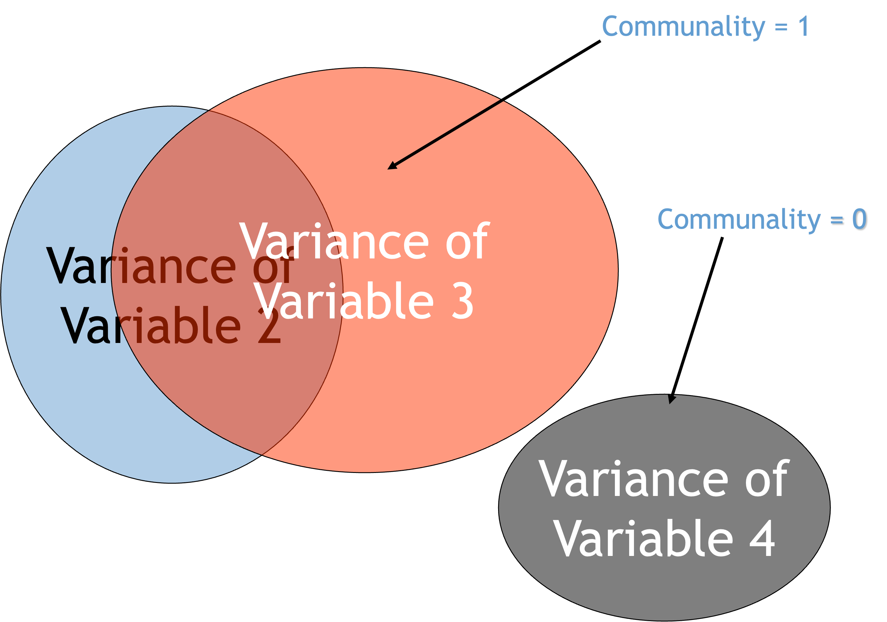{fig-align="center"}

## Factors and Components: Not the Same Goal

FA aims for **parsimony** — explaining the maximum *common* variance using the fewest possible explanatory constructs, called **factors**.

PCA aims to explain the maximum amount of **total** variance in the correlation matrix.

It does this by transforming the original variables into a set of linear **components** instead.

## PCA vs EFA: The Real Technical Difference {.smaller}

| | PCA | EFA |
|---|---|---|
| Starting communality | Assumes 1.0 for every item — all variance is fair game | Estimated from the data (squared multiple correlation) |
| What that means | Components can absorb unique and error variance too | Factors only explain *shared* variance |
| How it finds the answer | Decomposes the data into linear components — only asks *which components exist* and how each variable contributes to them | Derives a mathematical model to *estimate* the underlying factors — only FA can do this |

This is the technical version of "PCA summarises, EFA explains."

## Decision 4: Rotation

Rotating axes doesn't change the structure underneath.

It just makes the structure easier to *read*.

Like turning a map so north points up.

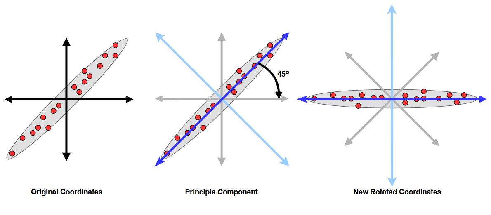{fig-align="center"}

<!-- 🖼️ PNG PLACEHOLDER: before/after pair of scatterplots showing the same data points with rotated axes -->

## Decision 4, Continued: Naming the Rotation Methods {.smaller}

| Family | Method | What It Does |
|---|---|---|
| Orthogonal | Varimax | Spreads loadings so each factor keeps a small number of high loadings — most common default |
| Orthogonal | Quartimax | Spreads loadings across factors for each *item* instead |
| Orthogonal | Equamax | A hybrid of Varimax and Quartimax — spreads loadings both within *and* across factors; used less often in practice |
| Oblique | Direct Oblimin | Lets factors correlate; you control how much via a "delta" setting |
| Oblique | Promax | A faster version of the same idea — useful for large datasets |

You won't need to choose beyond Varimax or Oblimin in this workshop — the table is here so the Jamovi menu doesn't feel unfamiliar.

## Decision 5: Orthogonal or Oblique?

Two rotation families. Same purpose — easier reading — different assumption.

## Decision 5, Continued: Comparing the Two {.smaller}

| | Orthogonal (e.g. Varimax) | Oblique (e.g. Oblimin, Promax) |
|---|---|---|
| Assumes factors are | Unrelated | Allowed to correlate |
| Realistic for psychology? | Rarely | Usually — traits like anxiety and stress *do* relate |
| Workshop default | — | **Yes, use this** |

<!-- Keep this table simple — it's the one students will refer back to most when choosing a rotation in Jamovi -->

## Decision 6: Reading the Loadings

A loading tells you how strongly an item relates to a factor.

Loadings above roughly .30–.40 count as meaningful.

An item loading on two factors is a "cross-loading" — a flag, not a crisis.

## Decision 6, Continued: Naming the Factors

The only step that isn't purely statistical.

Look at which items group together.

Give the group a name that fits the theme.

## Let's See It in Action

Worked example using real data: `bfi` personality items.

We'll run through all six decisions together, once, before you try it yourself.

## Common Pitfalls

Too few participants for the number of items.

Forcing a factor count the scree plot doesn't support.

Ignoring cross-loading items.

Calling PCA components "factors" in your write-up — this gets flagged often.

---

# Worked Example: The SAQ

## From Theory to Real Numbers

Everything so far has been the *logic* of EFA.

Now watch it applied to real data, start to finish, using a published example.

## The SPSS Anxiety Questionnaire (SAQ)

23 items designed to measure fear of statistics, SPSS, computers, and maths (Field, *Discovering Statistics Using SPSS*).

Same six decisions. Real SPSS output this time, not Jamovi — the interpretation logic transfers directly.

## The Whole Pipeline at a Glance

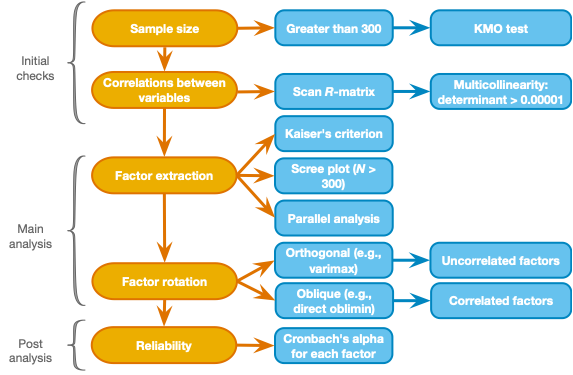{fig-align="center"}

## Decision 1: Checking Suitability

Sample size: 2,571 respondents — comfortably above the 300-participant guideline.

Scan the R-matrix for items correlating too low (< .3) or dangerously high (> .8) before proceeding.

## Decisions 2 & 3, in the Output: Communalities and the Initial Factor Matrix {.smaller}

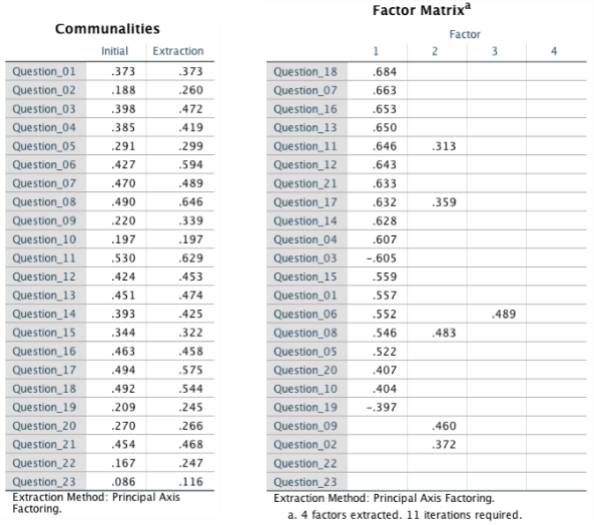{fig-align="center"}

Each item's communality (left) feeds into an initial, unrotated factor matrix (right) — still hard to read at this stage.

## Decision 2: How Many Factors, in Real Numbers {.smaller}

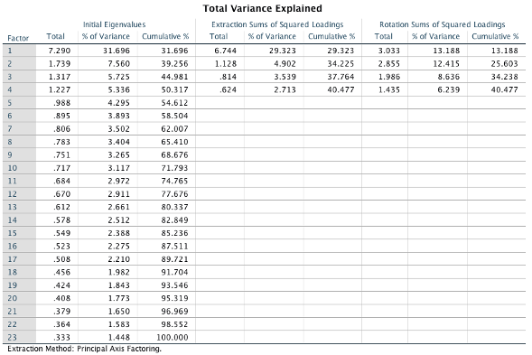{fig-align="center"}

Four factors clear Kaiser's eigenvalue > 1 rule, together explaining 40.5% of the variance.

## Decision 2: Confirmed by the Scree Plot

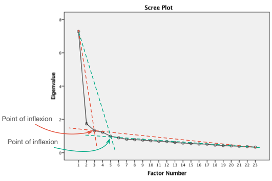{fig-align="center"}

The point of inflexion also lands at four factors — Kaiser and the scree plot agree here.

## Before Rotation: Why We Bother

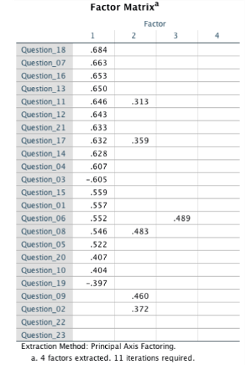{fig-align="center"}

Unrotated loadings pile onto Factor 1, with items spilling across multiple factors. Hard to name anything from this yet.

## Decision 5, Applied: Orthogonal vs Oblique on This Data

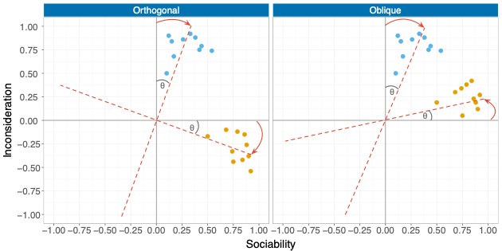{fig-align="center"}

Sociability and inconsideration items separate more cleanly once rotated. Orthogonal and oblique look similar here — they won't always.

## Decision 6, Applied: Varimax Rotation {.smaller}

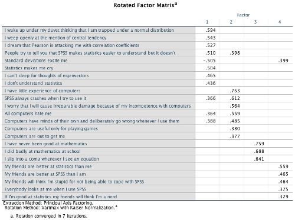{fig-align="center"}

Four clean factors emerge. Item wording tells you what to call them: fear of statistics, fear of computers, fear of maths, peer evaluation.

## Decision 6, Compared: Oblimin (Oblique) Rotation {.smaller}

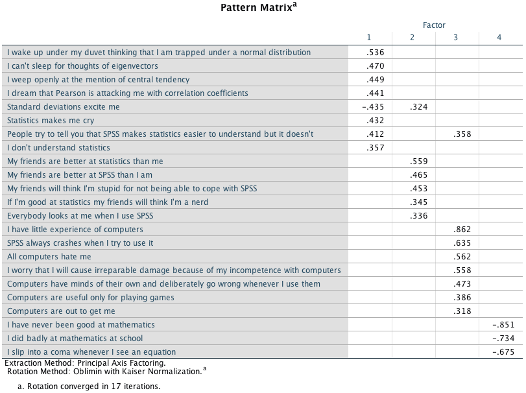{fig-align="center"}

Nearly the same four factors — reassuring, not redundant. When orthogonal and oblique agree, your factor structure is more trustworthy.

## One Step Further: Reliability

Naming factors isn't the end. Each subscale should also be internally consistent.

**Cronbach's alpha** averages the correlation across every possible way of splitting a subscale in half. Think of it as error variance: *α* = .70 leaves about 30% error, *α* = .80 leaves about 20%. *α* > .70 is the common benchmark (Kline, 1999).

Jamovi also reports **McDonald's omega (ω)** alongside alpha — a more robust alternative that doesn't assume equal item loadings or a single underlying factor. When alpha's assumptions hold, the two are usually close.

<!-- reminder: reverse-score reverse-worded items before computing alpha, or it can come out negative -->

## Reliability, Subscale by Subscale: Fear of Statistics {.smaller}

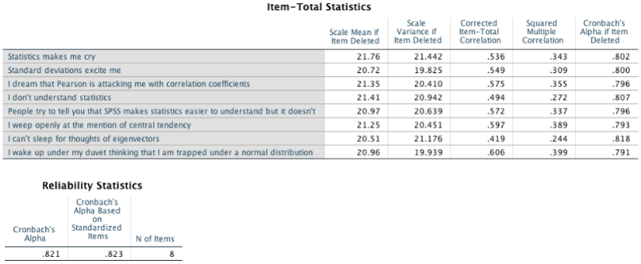{fig-align="center"}

α = .82 across all 8 items — solidly reliable, and every "alpha if item dropped" value is *lower* than .82, so nothing here is worth removing.

## Reliability, Continued: Fear of Computers {.smaller}

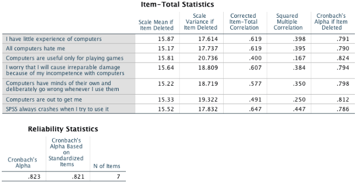{fig-align="center"}

α = .82 across 7 items — comfortably reliable, with only a negligible bump possible from dropping one item.

## Reliability, Continued: Fear of Maths {.smaller}

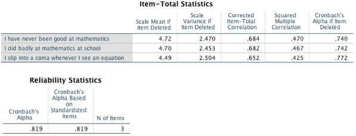{fig-align="center"}

α = .82 from just 3 items — a short subscale that still holds together well.

## Reliability, Continued: Peer Evaluation {.smaller}

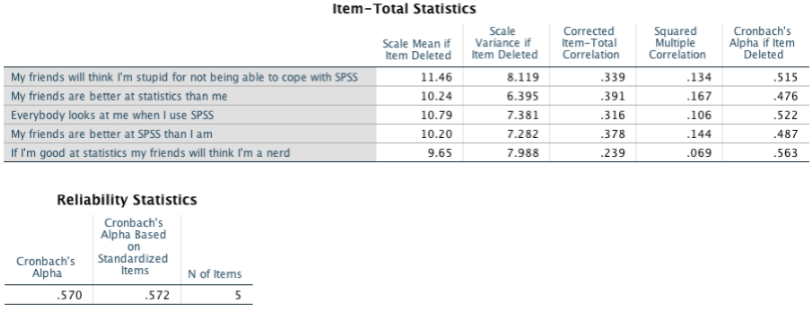{fig-align="center"}

α = .57 — the weakest of the four. Only five items, one of which barely correlates with the rest. Worth flagging in a write-up, not hiding.

## What Alpha Doesn't Tell You {.smaller}

A high alpha is **not proof of a single underlying construct** — alpha measures equivalence, not unidimensionality. A "reliable" α = .80 scale could still be blending more than one construct.

Alpha is also **sample-specific**: it's a property of your sample, not a fixed property of the scale itself. Expect it to shift somewhat across studies.

**Can alpha be too high?** Above *α* = .95, treat it as a warning, not a bonus — it usually means the items are overly redundant and the construct may be measured too narrowly.

Jamovi's "if item dropped" column shows whether removing an item would raise alpha — a small gain usually isn't worth the trade-off.

## What This Example Leaves You With

Four named, reasonably reliable subscales — not a single "SPSS anxiety" score.

Every decision from today, traced through one real dataset, start to finish.

---

# Part 3: PCA vs EFA

## Same Family, Different Job

Both reduce many variables into fewer.

That's where the similarity ends.

## Look at the Arrows

Watch which way the arrows point — that's the whole difference.

PCA: items *build* the component. EFA: the factor *causes* the items.

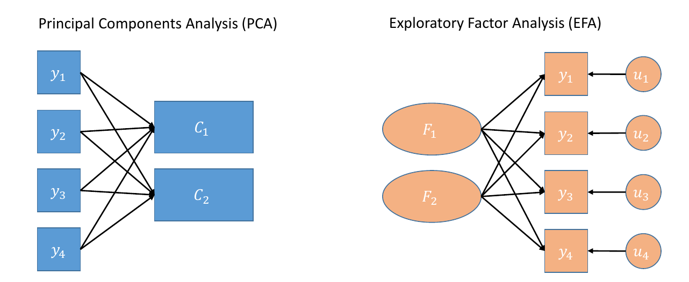{fig-align="center"}

## Side-by-Side {.smaller}

| | PCA | EFA |
|---|---|---|
| Assumes | Nothing caused the pattern | A hidden trait caused the pattern |
| Question answered | "What's the best summary of my data?" | "What unmeasured trait explains my data?" |
| Typical use | Data reduction, composite scores | Scale development, construct validation |
| Use for your thesis if... | You just need fewer variables to work with | You're testing/building a psychological construct |

## The One Rule to Remember

Validating a psychological scale? Use EFA.

Reviewers will ask why, if you use PCA instead.

---

# Recap

## Three Questions, Answered

1. PCA or EFA? — depends whether you assume a real hidden cause.
2. How many factors? — eigenvalues, scree plot, and trust parallel analysis most.
3. Reading loadings? — above ~.30–.40 is meaningful; name factors from the pattern.

## Next: Hands-On in Jamovi

You'll run a PCA, then a full EFA, on real data.

Then you'll name your own factors — just like today's worked example.

---

# Tutorial Preview (Jamovi)

## What You'll Do This Hour

1. Quick PCA demo — `HolzingerSwineford1939.csv`
2. Full EFA — `bfi.csv` (25 personality items)
3. Read the loading table, name the factors as a group

## One Thing to Watch For

Seven items in `bfi` need reverse-scoring before the results are fully correct.

Check the codebook before you interpret anything.

## See You in the Lab

Open Jamovi. Load `bfi.csv`. Let's begin.

---

# Jamovi Walkthrough: PCA, Step by Step

## The Data We're Using

`HolzingerSwineford1939.csv` — 301 students, two schools.

Nine cognitive ability test scores: `x1`–`x9`.

## Read the Codebook First

Full variable definitions are in `Data/HolzingerSwineford1939-codebook.md`.

We only analyse `x1`–`x9`.

`id`, `sex`, `ageyr`, `agemo`, `school`, `grade` are identifiers — leave them out.

## Step 1: Open the Data

File → Open → `HolzingerSwineford1939.csv`.

Check that `x1`–`x9` are read in as **continuous**, not nominal.

## Step 2: Check Your Data Before You Analyse It

Never run PCA the moment data loads.

Three quick checks first — descriptives, sample size, and redundant items.

## Step 2a: Run Descriptives

Exploration → Descriptives → move `x1`–`x9` in.

Check N, missing count, mean, SD, min/max, skewness/kurtosis.

Catches data-entry errors and unexpected missingness before they contaminate your PCA.

## Step 2b: Is Your Sample Big Enough?

Rule of thumb: at least 5–10 respondents per item, or *N* ≥ 100–200 overall.

Our data: 301 students, 9 items — comfortably sufficient.

## Step 2c: Check for Redundant Items

Under PCA's Assumption Checks, tick the **correlation matrix determinant**.

A value too close to zero means some items are near-duplicates of each other — PCA's maths breaks down.

If this happens, consider dropping one of the overlapping items.

## Step 3: Run PCA

Analyses → Factor → Principal Component Analysis.

Move `x1`–`x9` into the **Variables** box.

## Step 4: Turn On the Suitability Checks

Tick **KMO test of Sampling Adequacy**.

Tick **Bartlett's Test of Sphericity**.

These tell you whether your items are correlated enough to bother.

## Step 5: Decide How Many Components

Tick **Eigenvalues table** and **Scree Plot**.

Tick **Parallel Analysis**, if your Jamovi version offers it.

Start with eigenvalues > 1, then check the scree plot agrees.

## Step 6: Read the Component Loadings

Tick **Hide loadings below**, set it to **0.3**.

Tick **Sort by loading size**.

This is the table you'll actually interpret.

---

# Interpreting the PCA Output

## Five Checks, in Order

Suitability. How many components. Loadings. Variance explained. Then decide.

## Check 1: Is KMO Good Enough? {.smaller}

| KMO Value | Interpretation |
|---|---|
| Below .50 | Unacceptable — don't proceed |
| .50–.59 | Poor |
| .60–.69 | Mediocre |
| .70–.79 | Good |
| .80–.89 | Great |
| .90 and above | Excellent |

## Check 2: Is Bartlett's Test Significant?

*p* < .05 → items are correlated enough. Proceed.

*p* > .05 → stop. PCA is not appropriate for this data.

## Check 3: How Many Components?

Same three methods from the lecture: Kaiser, scree plot, parallel analysis.

They don't always agree — **trust parallel analysis** if they don't.

## Check 4: Are the Loadings Meaningful? {.smaller}

The cutoff depends on your sample size — smaller samples need higher loadings to trust.

| Sample Size | Minimum Loading to Interpret |
|---|---|
| 150 or fewer | .45 or higher |
| 150–300 | .35 or higher |
| 300 or more | .32 or higher |

Our HolzingerSwineford data has *N* = 301 — use **.32** as the cutoff.

*This is a rounded, practical version of Stevens' (2002) sample-size cutoffs — see the fuller table next.*

## Check 4, Continued: Where That Cutoff Comes From {.smaller}

Stevens (2002) gives a more precise, *N*-specific version of the same rule — a general statistical guideline, not tied to SPSS or any other software. It's still the standard reference cited in Jamovi- and R-based textbooks today.

| *N* | Minimum Loading | *N* | Minimum Loading |
|---|---|---|---|
| 50 | .72 | 300 | .30 |
| 100 | .51 | 600 | .21 |
| 200 | .36 | 1,000 | .16 |

**Squaring a loading** tells you how much of that item's variance the factor explains — e.g. a loading of .40 → the factor accounts for 16% of that item's variance. A loading around .40 is a common floor for "meaningful," on top of whichever significance cutoff above applies.

## Check 5: How Much Variance Is Explained?

Look at the cumulative "% of Variance" column in the eigenvalues table.

Aim for at least **50–60% cumulative variance** across retained components.

Lower isn't automatically wrong — just be ready to justify it.

## Putting It All Together

Good KMO, significant Bartlett's → your data is suitable.

Methods agree on component count → keep that many.

Loadings clear the cutoff, variance is reasonable → your solution is interpretable.

---

# Jamovi Walkthrough: EFA, Step by Step

## The Data We're Using

`bfi.csv` — 2,800 respondents, 25 personality items.

Five expected traits: Openness, Conscientiousness, Extraversion, Agreeableness, Neuroticism.

## Read the Codebook First

Full item wording and scoring in `Data/bfi-dataset-codebook.md`.

`rownames` is an ID column — leave it out of the analysis.

## Step 1: Open the Data

File → Open → `bfi.csv`.

Confirm all 25 items (`A1`–`O5`) are read as continuous.

## Step 2: Check Your Data Before You Analyse It

Same three checks as PCA — descriptives, sample size, redundant items.

Plus one check specific to this dataset: reverse-keyed items.

## Step 2a: Run Descriptives

Exploration → Descriptives → move all 25 items in.

Check missingness carefully — unlike `HolzingerSwineford1939`, `bfi` has real missing data.

Watch for means/SDs that look implausible for a 1–6 scale.

## Step 2b: Is Your Sample Big Enough?

2,800 respondents, 25 items — comfortably exceeds every rule of thumb.

Worth noting out loud: most thesis samples won't be this large. Don't let this dataset set your expectations.

## Step 2c: Correct the Reverse-Keyed Items {.smaller}

Seven items are worded in the opposite direction and must be reverse-scored first.

| Trait | Reverse-keyed items |
|---|---|
| Agreeableness | A1 |
| Conscientiousness | C4, C5 |
| Extraversion | E1, E2 |
| Openness | O2, O5 |

Good news: Jamovi's EFA module has a built-in **Reverse Scaled Items** box — no manual recoding required.

## Step 3: Run EFA

Analyses → Factor → Exploratory Factor Analysis.

Move all 25 items into **Variables**.

Move `A1`, `C4`, `C5`, `E1`, `E2`, `O2`, `O5` into **Reverse Scaled Items**.

## Step 4: Turn On the Suitability Checks

Tick **KMO test** and **Bartlett's Test of Sphericity**, same as PCA.

With *N* = 2,800, both will almost certainly pass — the real test comes later.

## Step 5: Choose Extraction and Rotation

Extraction: **Maximum Likelihood** — lets you also check model fit.

Rotation: **Oblimin** (oblique) — the workshop default from the lecture.

## Step 6: Decide How Many Factors

Tick **Eigenvalues**, **Scree Plot**, and **Parallel Analysis**.

We expect 5 factors going in — check whether the data agrees.

## Step 7: Read the Pattern Matrix

Tick **Hide loadings below**, set it to **0.3**.

Tick **Sort by loading size**.

This is the table you'll use to name your factors.

## Step 8: Turn On Model Fit

Tick **RMSEA** and **TLI** under fit measures.

These only appear with Maximum Likelihood extraction — one more reason we chose it.

---

# Interpreting the EFA Output

## Six Checks, in Order

Suitability. Factor count. Loadings. Cross-loadings. Fit. Naming.

## Checks 1 & 2: KMO and Bartlett's

Same cutoffs as PCA — KMO above .60, Bartlett's *p* < .05.

## Check 3: How Many Factors?

Same three methods as before: Kaiser, scree plot, parallel analysis.

Now compare the answer against your **theoretical expectation** — 5 traits.

If parallel analysis disagrees with theory, that's a discussion point for your write-up, not necessarily a mistake.

## Check 4: Are the Loadings Meaningful? {.smaller}

Same cutoff table as PCA, by sample size — and the same Stevens (2002) logic underneath it.

| Sample Size | Minimum Loading to Interpret |
|---|---|
| 150 or fewer | .45 or higher |
| 150–300 | .35 or higher |
| 300 or more | .32 or higher |

Our `bfi` data has *N* = 2,800 — use **.32** as the cutoff.

## Check 5: Cross-Loadings — When Is an Item a Problem? {.smaller}

| Pattern | What It Means |
|---|---|
| Loads above .32 on one factor only | Clean item — keep it |
| Loads above .32 on two factors, both similar in size | Cross-loading — flag it, discuss in your write-up |
| Doesn't load above .32 on any factor | Weak item — consider dropping it |

## Check 6: Is Model Fit Acceptable? {.smaller}

Only available with Maximum Likelihood extraction.

| Index | Good Fit | Acceptable Fit |
|---|---|---|
| RMSEA | Below .05 | .05–.08 |
| TLI | Above .95 | .90–.95 |

## Check 7: Naming the Factors

The interpretive step — no cutoff tells you this one.

Look at which items cluster together within each factor.

Small groups: name each factor in 2–3 minutes, then compare to the Big Five labels.

## Putting It All Together

Good KMO/Bartlett's, sample size adequate → data is suitable.

Methods agree near 5 factors, fit acceptable → solution is defensible.

Clean loadings, minimal cross-loading → ready to name and report.
